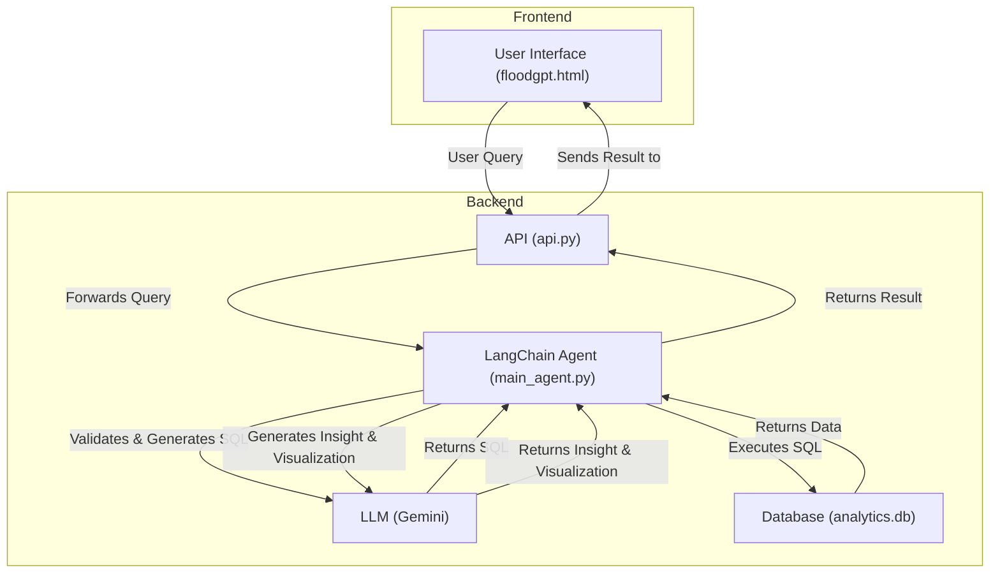

```mermaid
graph TD
    subgraph "Frontend"
        A["User Interface (floodgpt.html)"]
    end

    subgraph "Backend"
        B["API (api.py)"]
        C["LangChain Agent (main_agent.py)"]
        D["LLM (Gemini)"]
        E["Database (analytics.db)"]
    end

    A -- "User Query" --> B
    B -- "Forwards Query" --> C
    C -- "Validates & Generates SQL" --> D
    D -- "Returns SQL" --> C
    C -- "Executes SQL" --> E
    E -- "Returns Data" --> C
    C -- "Generates Insight & Visualization" --> D
    D -- "Returns Insight & Visualization" --> C
    C -- "Returns Result" --> B
    B -- "Sends Result to" --> A
```